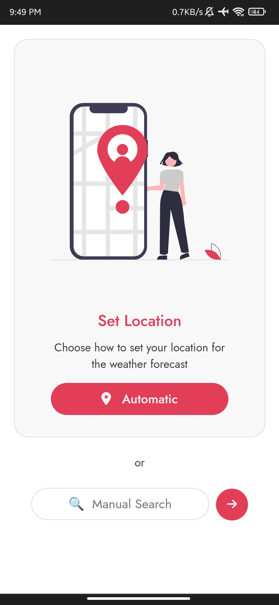
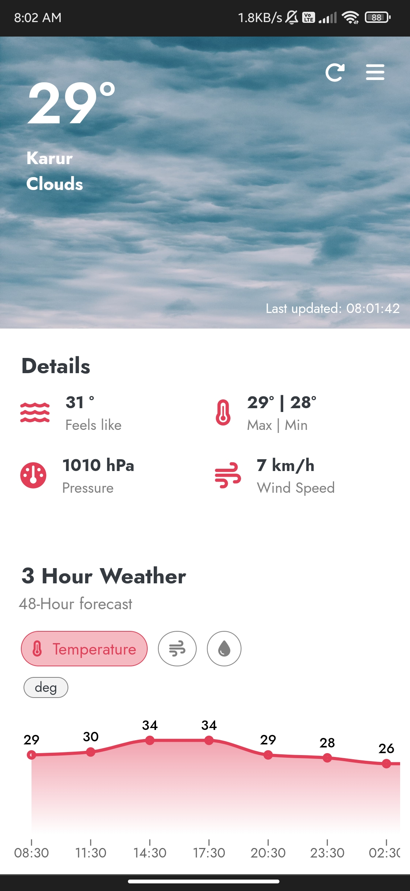
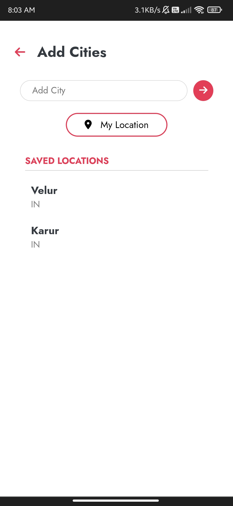

# React Weather Application

[Live URL](https://acgeoffrey.github.io/react-weather/)

## Features

- Mobile first design Application.
- This application fetches weather data from OpenWeatherMap API.
- Displays daily weather and 3-day forecast for next 48 hours.
- Add places by manually entering cities or automatically by GPS.
- Weather Data is stored in LocalStorage.

## Screenshots

<table>
  <tr>
    <td> </td>
    <td> </td>
   </tr>
   <tr>
   <td> </td></tr>
</table>

### Run

- Install the dependencies required by running npm install.
- Start the server by running npm run dev.
- Server should run on [http://localhost:5173](http://localhost:5173/)

### Built with

- React
  - Used Context API and useReducer hook to store and manage state on a global level.

### Author

- Geoffrey
